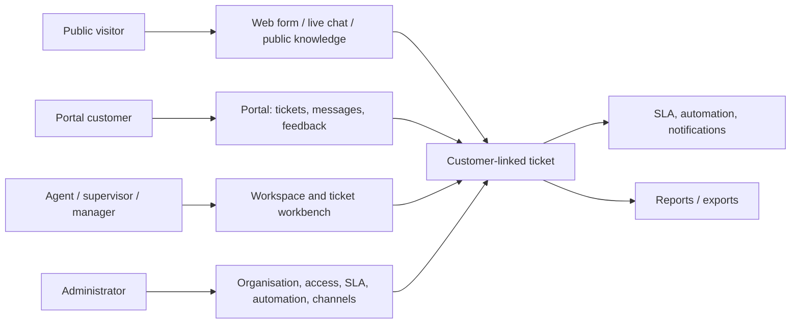
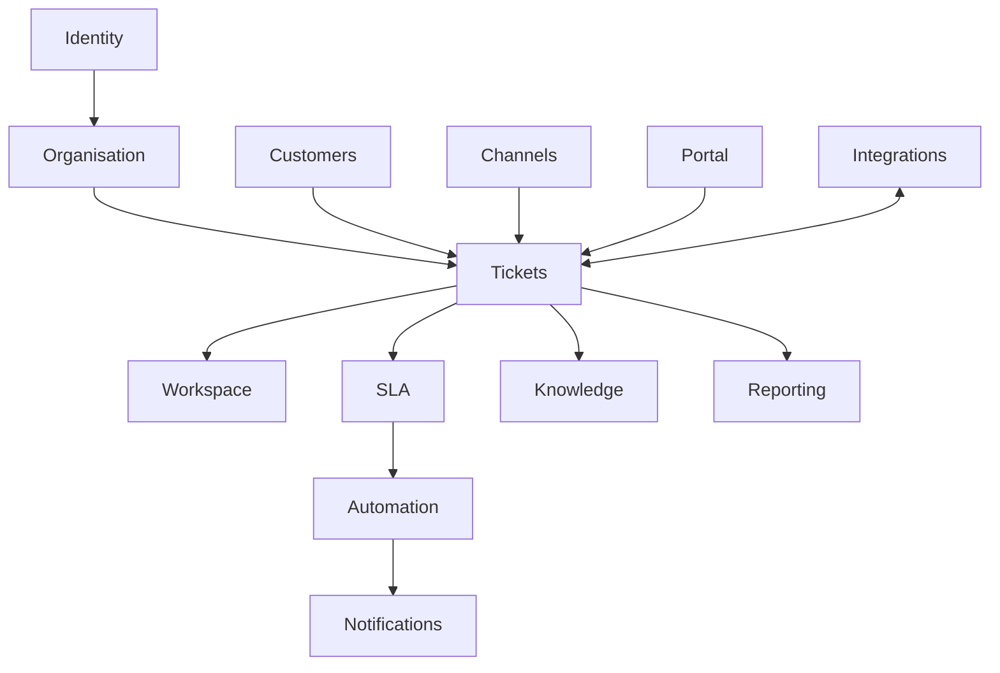
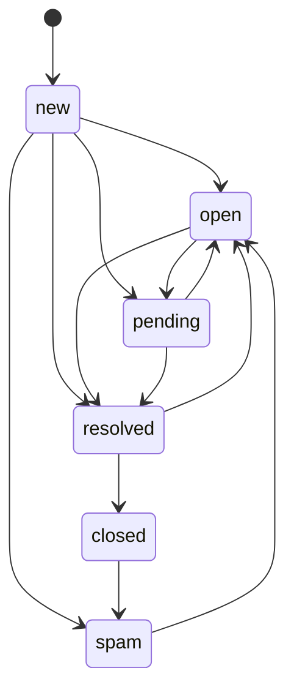
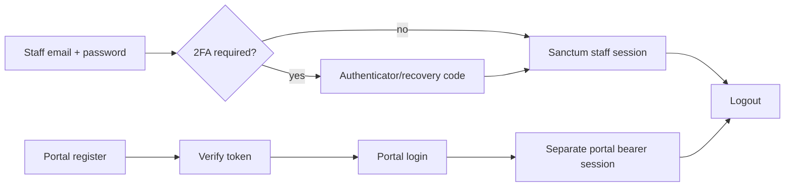
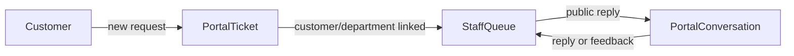

# Support CRM — business guide

## What this product is

Support CRM is a bilingual (Arabic/English) multi-branch customer-support operation. It receives support requests from staff, authenticated portal customers, public web forms, live chat, inbound email, WhatsApp and SMS provider webhooks; turns them into customer-linked tickets; lets scoped staff work and collaborate on them; measures response/resolution targets; and gives management administrative, reporting, automation, knowledge and integration controls.

The actual product boundary is a React SPA over `/api/v1`, with separate staff, portal and public routes. The backend, not a screen, is the authority for validation, visibility and transitions. Evidence: `routes/api.php`, `frontend/src/router.tsx`, `app/Domains/*`, `tests/Feature/*`.



## Business domains

| Domain | Business job and hand-off | Main actors | Evidence |
|---|---|---|---|
| Staff identity and access | Authenticate staff, enforce 2FA policy, permissions, branch/department/team scopes, invitations and audit trail. | all staff; admin manages | `Security`, `frontend/src/auth`, `tests/Feature/Security/*` |
| Organisation | Model branches (calendar/time zone/holidays), departments, teams and staff placement. This supplies ticket visibility and SLA working time. | admin/manager; scoped staff consume | `Organisation`, `BranchCalendarsSeeder.php` |
| Customers | Maintain customer identity, contacts, notes, files, timeline, duplicates/merge and blocked state. Customer feeds ticket creation and portal ownership. | agent+ according to capability | `Customers`, `Customer*Test.php` |
| Tickets/workbench | Create, classify, assign/claim/transfer, reply/note, watch, link/split/merge, change lifecycle and keep history. Work moves to assignee, team or department. | agent/supervisor/manager/admin; portal submits/messages | `Ticketing`, `TicketDetailPage.tsx` |
| Workspace | Give staff their personal queue, department queue (when permitted), tasks, quick replies, notifications and SLA-risk work. | staff with relevant permissions | `Workspace`, `WorkspaceV2.tsx` |
| SLA and automation | Apply branch working-time targets, pause on non-running lifecycle states, raise warnings/breaches and execute rules. | management configures; staff reacts | `Sla`, `Automation`, `routes/console.php` |
| Channels | Ingest/replay email; process SMS/WhatsApp provider messages and receipts; expose public forms and visitor chat. | public visitors, providers, channel operators | `Channels`, `ChannelsPage.tsx` |
| Knowledge and AI | Staff authors governed articles; published public/portal articles are searchable. AI can generate controlled suggestions, which need human resolution. | authors, publishers, customers/visitors | `Knowledge`, `Ai`, `KnowledgeVisibilityTest.php` |
| Portal | Separate customer account registration/verification/login; customer can only see its own tickets/messages/files and provide feedback. | portal customer | `Portal`, `PortalGuardIsolationTest.php` |
| Reporting/integrations | Scoped report reading; queued export and scheduled delivery; API tokens, webhook delivery, ERP context and imports. | manager/admin and tailored custom roles | `Reporting`, `Integrations` |



## Confirmed state machines

### Ticket lifecycle

New is the creation state. A ticket may be moved `new → open|pending|resolved|spam`; `open → pending|resolved|spam`; `pending → open|resolved|spam`; `resolved → open|closed|spam`; `closed → spam`; and `spam → open`. Moving to spam and reopening resolved/spam needs a reason. Pending, resolved, closed and spam stop the SLA clock; closed and spam are terminal. The exact available catalogue status is returned with each ticket, so a custom status label still follows this lifecycle type. Evidence: `TicketTransitionMap.php`, `TicketStatus.php`, `TicketResource.php`.



### Other governed states

| Entity | Transition | Who observes result |
|---|---|---|
| Agent task | `open ↔ in_progress → done/cancelled`; done/cancelled cannot move. | owner, creator and users with “view others” scope | 
| Knowledge article | `draft → in_review/archived`; `in_review → draft/published/archived`; `published → archived`; `archived → draft`. | staff; only published public-visibility content reaches public/portal users |
| Outbound delivery | `queued → sent/failed → (delivered/read/failed)`; failed can retry to queued. Read only where the channel supports receipts. | staff delivery history; provider async job |
| Chat session | requested → queued/active/abandoned; queued → active/abandoned/ended; active → transferred/ended/abandoned. | visitor and accepting/transferred staff |
| Report export | pending → running → ready or failed. | requester; backend has no route to poll/download an export artifact in the SPA contract—see gaps |

```mermaid
sequenceDiagram
  participant C as Portal customer
  participant A as Agent
  participant S as Supervisor
  C->>A: Creates ticket / sends public message
  A->>A: Claims or is assigned; replies or adds internal note
  A->>S: Creates task, mentions/watches, or escalates
  S->>A: Reassigns/reviews or completes task
  A->>C: Public reply / status progress
  C->>A: Reads and may send reply or feedback
```

## Authentication and customer loop





## What is truly implemented versus merely available in the backend

The current SPA has V2 workbench/list/workspace/knowledge screens and a mixture of generic V1-style operations pages. They are all reachable as routes listed in `PAGE_BY_PAGE_GUIDE.md`; “V2” does **not** mean old routes disappeared. The backend also exposes some advanced endpoints that the SPA does not put on a complete operational screen (notably ticket link/merge/split/spam/reopen/transfer, quick-reply administration, customer contacts, status management, SLA reset, notification preferences/delivery failures and most attachment upload flows). Those are implementation-supported API capabilities, but not all are manually reachable through the delivered UI. This distinction is important when accepting a manual test result.

## Background behaviour

Run a queue worker for email/provider messages, notifications, webhooks, imports and exports. Run `php artisan schedule:work` (or a cron invoking `schedule:run`) to execute: SLA sweep and task-reminder sweep every five minutes; automation/report schedules every ten minutes/five minutes; email resweep every ten minutes; chat session sweep every five minutes; hourly expired-ticket close; and daily backup/verification/retention. `composer dev` starts a queue listener but not the scheduler. Evidence: `routes/console.php`, `app/Domains/*/Jobs`.

## Major testing gotchas

- Roles are defaults, not the authorization engine: permissions and their scope (`own`, `team`, `department`, `branch`, `any`) are evaluated server-side. A custom role can behave unlike its name.
- Staff must have branch and usually department/team placement for meaningful scoped work. E2E Agent is not seeded into a department/team.
- Portal identity is not a staff User and cannot call staff API routes (`portal.deny`); it sees only its customer’s records.
- Internal notes are invisible to portal users; public replies are the customer-facing conversation.
- Ticket filters and saved views can make an apparently “missing” ticket disappear; use All / clear filters and check lifecycle status.
- Integrations need real provider URLs/credentials/webhook traffic; do not infer delivery from a locally sent message.

## Source reconciliation

README describes broad product intent accurately at domain level, but it overstates end-to-end UI coverage in places. The router and components show that parts of the backend capability are currently no-screen/API-only; the known examples and effects are itemized in `PROJECT_GAPS_AND_AMBIGUITIES.md`. The implementation used for this guide is `routes/api.php`, policies/actions and tests, with README as secondary context.
